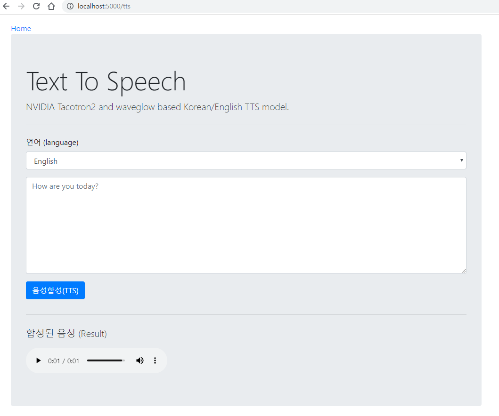

# Flask-Tacotron2-TTS-Web-App

This repo was forked  from [NVIDIA/Tacotron2](https://github.com/nvidia/tacotron2) for inference test only (not for training).

Because I didn't know flask well, I forked [CodeDem/flask-musing-streaming](https://github.com/CodeDem/flask-music-streaming).

If you want to test **NVIDIA Tacotron2** models in ` jupyter notebook`, you better try  inference model [NVIDIA/Tacotron2](https://github.com/nvidia/tacotron2) . 



## Requirements

`python 3.6`

`CUDA 10.0`

`pytorch 1.1.0`

`tensorflow 1.13.1`

## Installation

1. Install requirements [CUDA 10.0](https://developer.nvidia.com/cuda-10.0-download-archive), [PyTorch 1.1.0](https://pytorch.org/get-started/locally/) 

2. `pip install -r requirement.txt`

3. clone this repo:` https://github.com/NVIDIA/waveglow.git` 

   or `git submodule init; git submodule update`

4. you may need models tacotron2, waveglow both :

   1. NVIDIA/Tacotron2's model for inference demo: [Tacotron 2](https://drive.google.com/file/d/1c5ZTuT7J08wLUoVZ2KkUs_VdZuJ86ZqA/view?usp=sharing) ,  [WaveGlow](https://drive.google.com/file/d/1WsibBTsuRg_SF2Z6L6NFRTT-NjEy1oTx/view?usp=sharing)

   2. or My trained [models](https://drive.google.com/file/d/1H790Ho3XWFdAtxuY74SxDMIYzjl4zu-x/view?usp=sharing): 

      Tacotron2: English_90k_steps(ljspeech dataset), Korean_162k_steps(kss dataset)

      Waveglow: waveglow_152k_steps using Korean dataset


**If you get this error**

```
ModuleNotFoundError: No module named 'tacotron2.layers'
```

**try this step**

```
export PYTHONPATH="$PYTHONPATH:/path/to/flask-tacotron2-tts-web-app"
```


## Usage

`python app.py`

 or You can test tts on console: `python console_test.py`

in `config.json`, you can change models' path.


## Results

You can see  `Warning! Decoder Max`  on console.

In this case, your synthesized audio will have 11 seconds length and weired sounds.

This problems many happen in my korean trained model, but hardly happen in my english trained model.

I can't find any difference from synthesized audio  between `waveglow_256channels.pt`(waveglow demo) and my `waveglow_152k` .


​      

​      